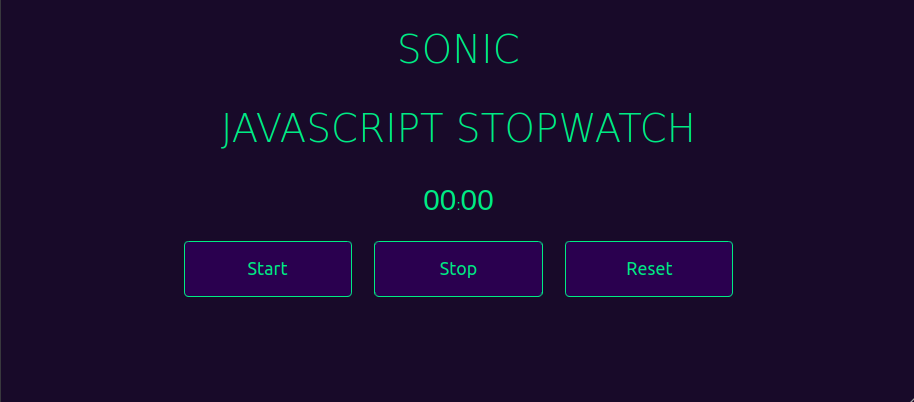

<h1 align="center">
  Sonic Javascrip Stopwatch
</h1>
Projetado para medir a quantidade de tempo que decorre entre sua ativação e desativação, tendo também a possibilidade de ser resetado.
  

  

## 🚀 Tecnologias

<ul>
  <li>HTML5</li>
  <li>CSS3</li>
  <li>Javascript</li>
</ul>
